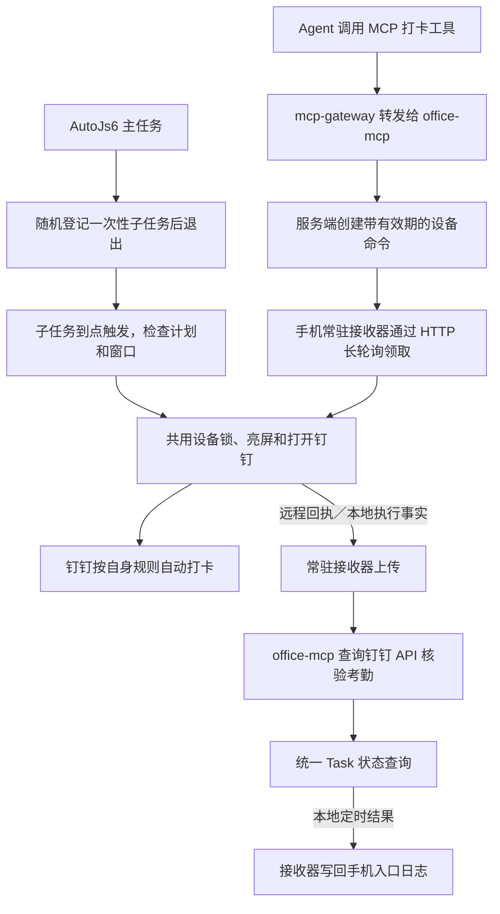

# AutoJs6 定时与远程打卡

本目录实现两条触发链路：AutoJs6 本地定时任务，以及 MCP 调用对应的手机远程接收器。两者共用“亮屏 → 请求打开钉钉 → 继续保亮”的设备动作，由钉钉已配置的自动打卡完成业务，不模拟点击、不解锁、不修改定位或钉钉规则。

## 文件与整体流程

| 文件 | 职责 |
|---|---|
| [autojs6_autowake.js](autojs6_autowake.js) | 定时入口：随机规划、子任务执行、直接动作、取消待执行计划 |
| [office_device_actions.js](office_device_actions.js) | 两种入口共用的设备动作、文件锁和截止时间检查 |
| [office_remote_listener.js](office_remote_listener.js) | 常驻接收器：领取远程命令、持久化去重、执行动作、回传结果 |
| [office_attendance_queue.js](office_attendance_queue.js) | 本地执行事实持久化、补报、取回核验结果及写回入口日志 |
| `remote-config.local.json` | 远程连接地址、设备凭据和动作参数 |



MCP 接口由网关提供，手机通过 HTTP 主动领取命令，不需要开放监听端口。本地定时动作独立运行；上午随机子任务执行后也会由常驻接收器上报，进入同一套 Task 核验。断网或接收器停止时，动作仍按原窗口执行，事实保留在手机等待当天恢复补报；上报和结果回写需要常驻接收器运行。

## 本地定时逻辑

### 时间配置

日期、星期和是否循环由 AutoJs6 的主任务决定；脚本 CONFIG 描述主任务运行当天的时间窗口。所有定时时间按手机本地时间解析，不能跨午夜。

| CONFIG | 当前值 | 含义 |
|---|---|---|
| `mode` | `"random"` | 主任务运行时规划当天随机子任务 |
| `randomStart` | `"08:45:00"` | 实际执行窗口起点 |
| `randomEnd` | `"08:58:00"` | 发起设备动作的硬截止时间 |
| `delayBufferSeconds` | `180` | 窗口尾部预留 3 分钟，允许 1～3600 的整数 |
| `minPlanningLeadSeconds` | `10` | 规划必须至少早于窗口起点这些秒数，允许 10～3600 的整数 |
| `openAppDelayMs` | `800` | 亮屏后、请求打开应用前的等待时间 |
| `keepScreenOnSeconds` | `15` | 启动请求处理后继续保亮的秒数 |
| `verifyScheduledAttendance` | `true` | 仅上午随机子任务登记上班核验事实；不改变动作或随机窗口 |

随机目标在 **`[randomStart, randomEnd - delayBufferSeconds]` 的整数秒中均匀抽取，包含两端**。当前目标范围为 **08:45～08:55**；系统延迟后，只要已到目标时刻且不晚于 **08:58**，仍可执行。

配置的 3 分钟是尾部余量，不是每次最多允许迟到的时长，也不是系统延迟的保证上限。不能先从原窗口抽取再直接减去余量，否则可能早于起点。窗口长度小于余量时拒绝登记，恰好等于余量时只有起点一个候选时刻。

### 从规划到执行

1. **主任务规划。** 建议上午主任务安排在 08:30。实际启动必须不晚于 `randomStart - minPlanningLeadSeconds`，当前为 08:44:50；太晚则记录 `SKIP` 并退出，不缩短随机范围或挪到明天。同一文件当天已有有效计划时不重新随机。
2. **保存并登记。** 保存随机目标、完整窗口、余量和保亮参数快照，先记为 `creating`。调用 `tasks.addDisposableTask`，`date` 传数字毫秒时间戳，使用 `delay: 0`、`loopTimes: 1`、`interval: 0`、`isAsync: false`。取得 ID 并回读成功后记为 `pending`；失败记为 `schedule_failed` 并尽力清理残留任务。主任务随即退出，不等待到点，也不亮屏。
3. **识别子任务。** 再次运行同一文件时，通过执行 Intent 的 `task_id` 匹配保存的计划；匹配后进入执行分支，不再次规划。只有 `pending` 可以执行。校验时间快照后，先保存 `claimed`、实际触发时间及调度偏差，再判断 `目标时刻 <= 当前时刻 <= 截止时间`。
4. **执行或跳过。** 提前触发记为 `skipped/not_due`，超过窗口记为 `skipped/window_expired`，均不自动补执行。窗口内进入共用动作；获取锁、亮屏重试和打开前等待期间继续检查截止时间。亮屏后若已过期，不再打开应用，计划记为 `expired`。

截止比较精确到毫秒：恰好在窗口终点允许请求，超过终点则禁止。截止限制发起设备动作，不保证钉钉已在该时刻前完成考勤，也不会在终点强制关闭应用或熄屏。

当前设备选择 **WorkManager**，这是 AutoJs6 应用的调度设置，不是 CONFIG 字段。调度入队不代表实际准点，脚本仍必须按实际启动时间检查窗口。

### 计划保存、去重与模式

计划保存在 `storages.create("autojs6.screen_wake.v1")`，以入口完整路径为键，值为 `{ plans: [...] }`。新计划使用 `policyVersion: 2`，保存 `id`、`day`、`at`、`startAt`、`endAt`、`delayBufferSeconds`、`keepSeconds` 和 `status`；执行时补充 `actualAt`、`delayMs`、`executionDeadlineAt` 及跳过原因或异常。

同一文件同一天，只有 `cancelled`、`schedule_failed` 不阻止重新规划。`claimed`、已执行、`skipped`、`expired`、`failed` 都会阻止当天再次随机，避免重启或改配置后自动补打。动作前保存领取标记，执行中断后不自动重做；不要并发运行同一文件的多个规划实例。

已登记计划继续使用保存的时间和保亮参数；修改 CONFIG 不会重新随机或改写这些快照。`enabled`、`mode` 及入口参数校验仍影响执行，是否打开应用、包名、打开前等待和日志开关使用执行时的 CONFIG。无 `policyVersion` 的旧计划继续使用其原规则 `min(endAt, at + maxLateSeconds × 1000)`；未知版本或损坏边界拒绝执行。

- `random`：没有匹配子任务 ID 时规划，匹配时执行对应计划。
- `direct`：普通手动运行立即动作，不受随机窗口限制；已匹配子任务仍按原计划检查。
- `cancel`：优先取消本文件的 `pending`、`creating` 子计划，只删除路径匹配的对应任务；不删除主任务，不清除已结束历史。使用后恢复 `random`。
- `enabled: false`：入口直接退出，不同时删除 AutoJs6 中的任务。

定时日志追加到 `autojs6_autowake.js.log`。`PLANNED` 表示登记成功，`RUN` 记录实际触发及偏差，随后仍可能跳过；`screen_on`、`already_on` 和 `APP_REQUESTED` 都不能证明考勤成功。应用启动失败时计划仍可能记录已亮屏，需要结合 `APP_ERROR`、`ACTION_RESULT` 判断。最终考勤看 `VERIFY_RESULT` 以及对应 Task 的 `attendance_confirmed`。

## 本地执行后的统一核验

仅当 `verifyScheduledAttendance: true` 且随机计划目标在手机本地时间上午（12:00 前）时接入，核验类型固定为 `OnDuty`；规划、下午计划和普通 `direct` 运行不创建本地核验任务。手机按北京时间使用。已启动但提前／过期跳过、动作失败或中断的子任务也尽量保存事实；本功能不检测根本未启动的子任务。

1. **先保存事实。** 子任务进入执行时生成 UUID `local_run_id` 并写入原计划；与可复用的 AutoJs6 数字任务 ID 分开。队列在 `.office-mcp/attendance/<local_run_id>.json` 保存开始、亮屏确认、启动请求、动作结束时间及结果。时间均为 UTC Unix 毫秒。期间持有独立执行锁，接收器不能抢先上报未完成的事实；引擎中断释放锁后，只补报已保存的不确定结果。
2. **接收器上报。** 原远程回执优先，每轮最多处理一个本地请求。通过设备认证调用 `POST /api/devices/{device_id}/attendance/executions`；员工由服务端配置绑定，手机不传员工 ID。网络失败保留原执行标识，30 秒后重试，不亮屏、不重新打开钉钉。请求连接／读取超时分别为 3／5 秒。
3. **统一核验。** 服务端创建 `source=local_schedule`、`state=verifying` 的仅核验 Task，不进入设备命令队列。沿用 Worker 默认每 5 秒读取 `/topapi/attendance/getupdatedata`，首次接受上报后最多核验 120 秒。同一事实重传返回同一 Task，不重置期限、不覆盖终态。原远程任务仍使用执行前基线，`source=remote_command`。
4. **当天补报。** 首次接受只允许北京时间当天，执行时间与工作日必须一致，未来时间最多允许 30 秒误差。已接受但响应丢失的上报，跨日重传仍返回原 Task。首次跨日补报被拒绝并保留手机记录，不补发动作。无法准确判断手机慢钟与真实离线延迟，因此要求手机时间准确；超过容差时可能不能正确匹配记录。
5. **取回结果。** 接收器通过 `GET /api/devices/{device_id}/attendance/tasks/{task_id}` 查询本设备任务，结果持久化后写回原入口日志；关闭 `writeLogFile` 时仅输出控制台。存在待处理事实时，远程领取最长等待从 25 秒缩为 5 秒；服务器仍独立按 5 秒核验。结果拉取与上报均不执行设备动作。正常任务可用同一个 `attendance_clock_in_status` 查询。

文件通过 Android [AtomicFile](https://developer.android.com/reference/android/util/AtomicFile) 完成写入后再替换，互斥由独立 Java 文件锁提供；网络请求不持有设备动作锁。队列记录保留用于排查，日志输出执行标识、Task、阶段与考勤摘要，不输出认证密钥、令牌或完整员工 ID。

| 结果 | 含义 |
|---|---|
| `succeeded` + `within_execution_window` | 官方有效记录时间在执行开始前 30 秒至执行后一个核验周期加 30 秒之内；确认记录与时间相符，不证明因果归属 |
| `already_completed` + `before_execution` | 官方有效记录早于执行开始前 30 秒，说明此前已有上班卡；本地动作仍可能已发生 |
| `unconfirmed` | 期限内未确认，包括无记录、未知状态、时间不符或查询故障；不能直接断言未打卡 |

迟到、严重迟到等有效记录可以确认已经打卡，考勤是否正常仍看官方 `status_code`。核验期间会保留最后观察记录、尝试次数、最后查询时间和安全错误；`attendance_confirmed=false` 时不能因为响应里有 `record` 就声称核验成功。本地任务的 `command_expires_at` 为 null，核验期限见 `verification_deadline`。

| 日志阶段 | 含义 |
|---|---|
| `VERIFY_LOCAL` → `VERIFY_QUEUED` | 执行事实已在手机保存，尚不代表服务器接受 |
| `VERIFY_PENDING` | 上报或查询暂未完成，等待重试 |
| `VERIFY_ACCEPTED` | 已得到服务端 `task_id` |
| `VERIFY_RESULT` | 最终状态、是否确认、真实打卡时间与官方状态 |
| `VERIFY_REJECTED` / `VERIFY_STORAGE_ERROR` | 协议被拒绝或本地保存失败，需要结合 Task／手机日志排查 |

日志示意（合成标识和时间）：

```text
RUN：实际=2026-09-20 08:47:27
VERIFY_LOCAL：执行事实已保存，local_run_id=<UUID>
SCREEN_ON：已确认屏幕点亮。
APP_REQUESTED：已请求打开钉钉，此回执不代表实际打卡成功。
VERIFY_QUEUED：等待上报，local_run_id=<UUID>
VERIFY_ACCEPTED：task_id=<Task UUID>，已进入服务端核验
VERIFY_RESULT：task_id=<Task UUID>，state=succeeded，attendance_confirmed=true，relation=within_execution_window，实际打卡=2026-09-20T08:47:31+08:00，考勤状态=Normal
```

本次不增加外部消息通知，也不增加额外设备动作、系统闹钟或任务未启动巡检。

## 手机远程接收器逻辑

`office_remote_listener.js` 作为普通脚本常驻，通过 `.office-mcp/remote-listener.lock` 保证同目录只有一个接收实例。它只接受固定动作 `wake_dingtalk`，目标包名固定为 `com.alibaba.android.rimet`，不执行远程传入的脚本或路径。

接收器每轮检查线程中断及本引擎的 `office_mcp.listener.stop` 标记。发布辅助可给目标引擎设置停止标记，等待现有短请求／长轮询返回后退出；已领取但尚未执行的命令保存不确定回执，不在重启后补做动作。必须确认旧实例已经退出，再启动新实例。

1. **领取命令。** 从同目录配置读取服务地址、设备 ID 和密钥，以 `X-Device-Id`、`X-Device-Key` 认证。向 `POST /api/devices/{device_id}/commands/lease` 长轮询，每轮最多等待 25 秒；无命令则继续下一轮，连接失败按 2、4、8、16、30 秒退避重连。
2. **持久化去重。** 使用 `office-mcp.remote.v1.<设备ID>` 存储。已存在 `done_<任务ID>` 时只准备重传原回执。新命令在动作前先保存结果为“不确定”的执行标记和 `pending_receipt`，避免动作发生后因中断而被盲目重做。
3. **换算有效期。** 使用 `expires_at_unix_ms - server_time_unix_ms` 计算剩余时间，再设置手机截止时间为 `Date.now() + 剩余时间 - 2000`，预留 2 秒传输余量。剩余时间必须有限、大于 2 秒且不超过 10 分钟，否则拒绝动作。远程命令遵守自己的有效期，不使用定时入口的上午窗口。
4. **执行并回执。** 调用共用动作模块，把动作结果和 `lease_token` 持久化，再向 `POST /api/devices/{device_id}/commands/{task_id}/report` 上报。临时失败时每 5 秒只重传回执，优先处理完回执再领取新命令；403、404 则清理待发送回执，避免一直阻塞。
5. **服务端核验。** `office-mcp` 对照执行前考勤基线读取钉钉官方 API。手机的 `launch_requested` 只是启动请求回执；只有服务端 `attendance_confirmed: true` 才表示已确认考勤记录。上班已有有效记录时不下发动作，下班已有记录时必须确认实际时间更新；超时未确认不能直接断言未打卡。

Agent 通过 `attendance_clock_in` 创建远程任务，同一操作重试复用 `request_id`。返回待处理的 `task_id` 后，用 `attendance_clock_in_status` 查询同一任务；该状态接口同时支持本地核验 Task。`attendance_query` 用于直接查询考勤。已领取命令不会因回执丢失而自动重发，过期命令也不补执行。

## 两条链路共用的设备动作

共用模块通过 Java 文件锁 `.office-mcp/screen-action.lock` 串行执行设备动作，最多等待 30 秒，同时受调用方传入的截止时间限制。锁覆盖亮屏、请求打开应用和额外保亮；等待超时或过期则返回相应结果，不延长窗口。

取得锁后确认屏幕状态；未亮时最多请求亮屏 3 次，每次等待 400ms 后检查。确认亮屏后按配置等待，再次检查截止时间和屏幕状态，调用 `app.launchPackage()`。启动请求处理后继续保亮指定秒数，结束时取消保持唤醒并释放锁，不主动熄屏；异常路径也需要释放资源。

设备互斥只保证动作串行，不能合并定时和远程的两次业务请求。两条链路分别持久化、分别判定有效期；停止远程接收器不删除定时任务，远程命令也不修改定时计划。

## 放置文件与远程连接

所有手机文件放在实际运行入口的同一目录，当前为 `/storage/emulated/0/脚本/自动打卡/`，以便共享模块、配置和文件锁。AutoJs6 导入可能生成副本，应核对任务使用的实际路径；更新前比较手机 CONFIG，保留用户已修改的参数。

远程配置示例：

```json
{
  "base_url": "http://192.0.2.10:18101",
  "device_id": "office-phone",
  "device_key": "替换为已配对的设备密钥",
  "keep_screen_on_seconds": 15,
  "open_app_delay_ms": 800
}
```

`device_key` 对应服务端设备凭据，不使用网关 API Key 或钉钉应用密钥。示例中的 192.0.2.10 是文档占位地址，需改为手机经 ZeroTier 等私有网络可访问的实际服务地址；远程保亮参数允许 0～30 秒，打开前等待允许 0～10000ms。

启用远程功能及本地核验时运行一次 `office_remote_listener.js` 并保持常驻，共用动作和队列模块不需要单独运行。升级时先发布含本地上报接口的后端，再将四个 `.js` 文件更新到实际入口目录，保留配置、已登记计划和 `.office-mcp`；停止旧接收器再启动，已运行实例不会热更新。不得通过手动运行定时入口来验收网络链路，以免触发设备动作。设备需具备无需人工解锁即可打开钉钉的条件，并保持 AutoJs6、ZeroTier 和钉钉所需的后台及网络能力。

后端与网关的部署说明见 [服务器部署说明](../docs/deployment.md)；本目录仅维护手机实现与配置说明。

## 核心开发约定

- 保持入口路径、存储名及已登记计划兼容；时间策略变化应明确版本和旧计划处理，不通过清空记录实现升级。
- 两条入口复用共用动作和同一设备锁，各自传入截止时间；等待、重试和异常处理不得扩大原有效期。
- 保持“调度成功、屏幕已亮、应用启动请求、实际考勤确认”的区别；未知结果不自动重做动作，也不表述为已打卡。
- 手机代码保持 AutoJs6/Rhino 兼容，目录解析使用 Java `File.getParent()`；关键函数及业务分支保留必要注释。逻辑变化时同步修改对应说明，不在 README 累积临时任务和排查历史。
