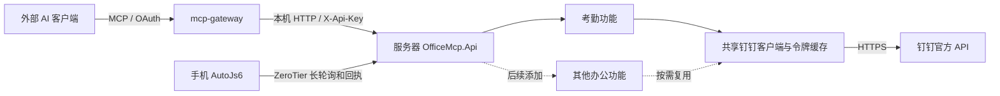

# 架构与已确认约定

本项目是 `mcp-gateway` 的考勤业务后端，生产环境运行在与 gateway 相同的 Linux 服务器上，以 ASP.NET Core 8 普通 HTTP API 对接网关。项目名保留 `office-mcp`，程序不实现 MCP 协议。源代码在办公电脑维护；后续必须访问办公机环境的能力应独立部署本地后端。

## 功能和基础设施边界

- `Program.cs`：HTTP 宿主与功能装配。
- `Features/Attendance`：考勤接口、业务整理、配置及响应契约。未来功能放在 `Features` 下的并列目录中，独立注册。
- `Features/DeviceCommands`：通用设备认证、命令持久化、领取和回执；`Attendance` 下的 `ClockIn` 流程负责考勤基线比较与后台核验。
- `Infrastructure/DingTalk`：跨功能共享的企业令牌、HTTP 客户端、业务错误处理和钉钉时间格式转换。
- `Infrastructure/Security`：网关到后端的 API Key 认证，独立于公网 OAuth 和钉钉应用密钥。
- `Infrastructure/Errors`：跨功能共享的 ProblemDetails 错误响应。

日期范围查询实时访问钉钉并缓存 accessToken。远程打卡通过 `BackgroundService` 核验结果，任务保存在 `data/device-commands`，使用原子文件替换和独占锁；无需数据库服务或 MCP SDK。详细流程见 [远程打卡方案](remote-clock-in-design.md)。

## 已确认接口行为

- `GET /api/attendance?start_date=yyyy-MM-dd&end_date=yyyy-MM-dd`，两个日期必填且各只能传一个值，包含首尾日期，默认最多 31 天；单日查询传相同日期。
- 仅查询服务端配置的固定用户，调用者不能指定其他 userId；固定值由服务端 `Attendance:UserId` 配置管理。
- 对外返回的 `user_id` 保留首尾各三位，中间逐位替换为 `*`；长度不超过六位时全部隐藏。完整 ID 仅用于服务内部查询和校验。
- 顶层返回按工作日升序排列的数组，每天恰好一个结果。每个工作日保留所有上下班时段，按计划时间排序，保留跨天记录。
- 每个日期包含 `success`；某日上游调用失败时，该日返回 `success: false` 和 `error`，不丢弃其他日期结果。`error` 包含安全错误码、说明和可用的钉钉错误码。
- 每条记录包含上下班类型、计划时间、实际时间、中文状态和原始状态码。
- 使用钉钉 `attendance_result_list` 中已经计算好的结果，不自行选择原始打卡流水，也不重新判断迟到、计算工时或汇总整天状态。
- 未打卡时间返回 `null`；仅当 `success: true` 时，空记录表示钉钉没有返回结果，不能推断成旷工或休息。
- 未识别状态返回“未知状态”，同时保留原始码。
- 返回时间带 `+08:00`，不受宿主机本地时区影响。钉钉无时区字符串按北京时间解析。
- `GET /openapi/v1.json` 提供文档，固定 operationId 为 `attendance_query`。文档和业务均要求 `X-Api-Key`。
- `GET /healthz` 匿名，仅表示宿主进程存活，不调用钉钉，也不证明外部 API 可用。

## 运行行为

令牌默认有效期由钉钉返回；提前最多 300 秒刷新，并发请求复用一次刷新。业务请求仅在明确的令牌无效/过期错误下刷新并重试一次。其他业务错误、限流、网络失败不自动重试。

单次上游 HTTP 超时默认 15 秒。范围查询在服务端逐日访问钉钉，每次查询的并发天数由 `Attendance:MaxParallelDays` 控制，默认 3；日期上限由 `Attendance:MaxQueryDays` 控制，默认 31 天。每日请求按日期索引写入响应，完成顺序不会改变输出顺序。

整次查询超时由 `Attendance:QueryTimeoutSeconds` 控制，默认 120 秒；到期后取消未完成请求，保留已完成结果，其余日期返回 `attendance_query_timeout`。网关示例超时为 150 秒，以便服务返回超时日期和部分结果。客户端取消仍取消整次工作，不继续访问钉钉。

日期范围合法时以 HTTP 200 返回结果数组，调用者必须逐日检查 `success`。钉钉业务、网络、格式错误和单日超时都放入该日 `error`，不转发上游原始错误正文；内部编程错误仍走统一 500 ProblemDetails。客户端日志禁用 URL 记录，业务结果也不写日志。

## 参考依据

- [钉钉获取用户考勤数据](https://open.dingtalk.com/document/orgapp/obtain-the-attendance-update-data)
- [阿里官方 API 字段与示例](https://developer.alibaba.com/docs/api.htm?apiId=37307)
- [钉钉企业内部应用令牌](https://open.dingtalk.com/document/orgapp/obtain-orgapp-token)
- [ASP.NET Core HTTP 请求](https://learn.microsoft.com/aspnet/core/fundamentals/http-requests?view=aspnetcore-8.0)
- [NSSM 使用说明](https://www.nssm.cc/usage)
