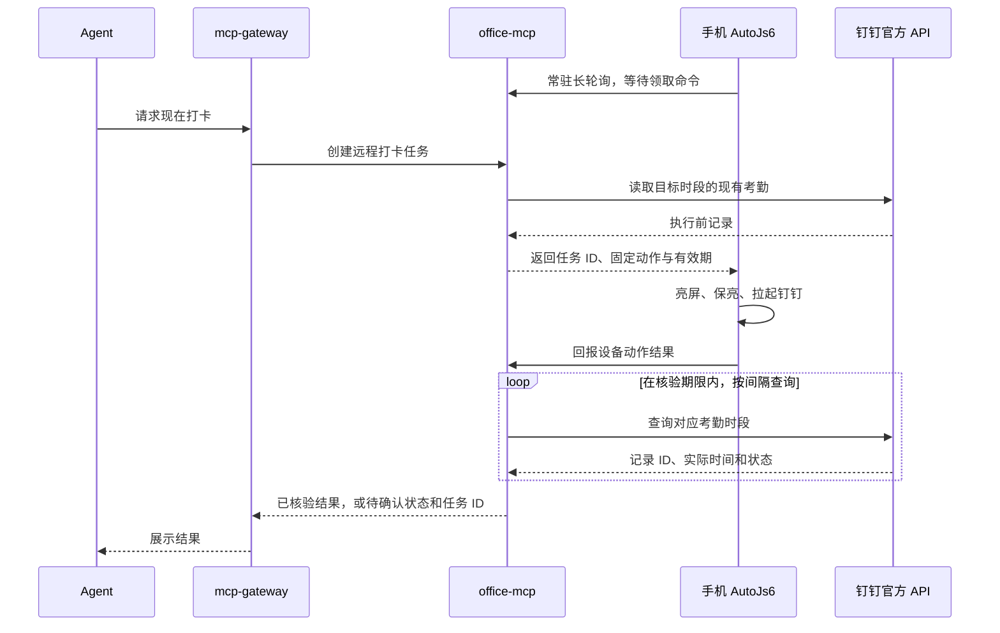

# AutoJs6 与远程打卡联动方案

日期：2026-09-15。已按本文约定实现服务端与手机脚本，部署步骤见 `autojs6/README.md`。仅完成构建与语法检查，尚未向手机下发命令或进行实机联调。

## 已确认目标

- 保留手机现有的定时／随机亮屏拉起钉钉功能。
- 第一版远程动作继续复用“亮屏 → 拉起钉钉 → 等待钉钉自动打卡”。
- 手机可新增独立常驻的 AutoJs6 接收脚本，优先及时响应。
- 用户已关闭手机锁屏，现有脚本已经能稳定完成实际打卡，无需人工解锁。
- 每天一次上班、一次下班；上班已有有效记录时不重复触发，下班允许重新触发并核验时间更新。
- Agent 通过现有 mcp-gateway 调用 office-mcp，最终由钉钉官方 API 核验实际考勤结果。

## 现有实现的边界

脚本位置：`autojs6/autojs6_autowake.js`。

`wake()` 会确认亮屏、暂时保亮并调用 `app.launchPackage()`。它不检查目标应用是否真的进入前台，也不模拟点击。应用启动失败会写日志，最终返回值仍仅表示亮屏状态，不能直接作为远程打卡成功回执。

`random` 模式通过 AutoJs6 一次性子任务执行，登记后主脚本退出。现有代码不包含网络命令接收循环。任务以脚本完整路径为记录键，存储名为 `autojs6.screen_wake.v1`；保留定时功能时应保持原手机文件路径、存储名、计划记录和截止规则。

## 建议链路

建议手机通过 ZeroTier 主动向办公服务发起 HTTP 长轮询。有任务时服务立即返回，无任务时等待一段时间再续接。这个方案不需要手机监听 HTTP 端口，也不需要在公网网关中保存手机执行逻辑。

AutoJs6 官方实现支持 HTTP 网络请求，因此接收任务和回传结果具备基础能力。Android 息屏后的后台联网、进程存活与启动应用限制仍需在实际手机上验证，不能据此承诺锁屏后必然即时响应。

## 两种触发方式共用执行动作

定时脚本继续独立运行。新增的常驻接收脚本负责收命令、去重、检查有效期及回报；定时和远程入口共用亮屏／启动应用动作。

将动作提取为可复用函数时，定时入口仍按原来的亮屏状态保存计划；远程入口记录更具体的动作结果，例如屏幕是否点亮、是否成功提交启动请求、是否过期。不要把 `screen_on` 或 `launchPackage()` 返回 true 映射成“考勤已成功”。

两个入口需要共享执行互斥，防止同时操作屏幕；原有随机计划仍遵守执行容差，远程命令不能修改、取消或重建这些计划。远程接收脚本退出或断网时，现有定时任务仍可按原规则执行。

## 服务端职责

新增通用设备命令模块，保存设备在线状态、命令队列和执行回执；新增远程考勤流程，组合设备动作与现有钉钉查询。mcp-gateway 继续负责 OAuth、工具映射和转发。

当前为单实例个人办公服务，使用任务文件原子替换、进程内锁和状态目录独占锁持久化命令，无需新增数据库依赖。服务重启后可以继续核验已下发任务。执行不明的任务先核验考勤，不因重启或回执丢失而盲目重新执行手机动作；未来需要多实例队列时可替换存储实现。

已提供以下接口：

| 调用方 | 接口 | 用途 |
|---|---|---|
| 网关 | `POST /api/attendance/clock-in` | 创建远程打卡任务，可有界等待核验结果 |
| 网关 | `GET /api/attendance/clock-in/{task_id}` | 查询同一任务的后续状态 |
| 手机 | `POST /api/devices/{device_id}/commands/lease` | 长轮询领取命令 |
| 手机 | `POST /api/devices/{device_id}/commands/{task_id}/report` | 上报动作进度或失败 |

手机使用独立设备凭据，只允许领取本设备命令和回报结果。钉钉应用凭据留在 office-mcp。命令内容只允许已实现的固定动作，不接收任意脚本文本或任意脚本路径。

创建打卡任务属于有副作用的操作，需要 POST 和正确的 MCP 工具注解。当前网关配置只导入 GET／`attendance_query`，接入时需要显式增加新的 POST 操作和状态查询操作，保留现有考勤查询工具。

## 结果核验

核验目标需要明确工作日和上班／下班时段。`check_type` 在第一版是核验目标，实际打卡仍由钉钉自动打卡规则决定；拉起应用不能强制钉钉选择某种打卡类型。

下发前读取基线，下发后在有上限的期限内复查；保存记录 ID，并以 `plan_id`／计划时间、`check_type` 和 `user_check_time` 判断目标时段的实际时间是否出现或更新。单独的记录 ID 变化不足以确认打卡。内部响应模型已补充记录标识，对外返回仍保持用户 ID 脱敏。

不能因为当天已有任意记录、存在一条 `Normal`，或手机报告已打开应用就判定任务成功。迟到等状态也可能表示已经完成打卡，应同时返回“是否已记录”和真实考勤状态。若 API 暂未返回变化，状态为“尚未核验”，不直接断言打卡失败。

任务应区分：等待设备、设备已领取、动作已提交、核验中、已确认记录、原本已完成、设备动作失败、过期、结果未确认。操作任务状态与考勤状态分别表达。

## 防止重复和过期执行

- Agent 重试相同请求时返回同一任务，避免重复入队。
- 设备领取与回执均按任务 ID 去重，手机持久化已处理记录。
- 同一设备在同一时刻只执行一个动作。
- 命令有明确有效期；手机恢复联网时拒绝执行已过期的“现在打卡”命令。
- 手机动作可能已经发生但回执丢失，此时优先核验，不声称跨网络和 UI 操作能够绝对保证只执行一次。
- Agent 一次调用可以等待一段时间；超过 HTTP 等待时间则返回任务 ID，服务后台继续核验，无需 Agent 连续调用钉钉查询。

## 实施前还需落实

1. 联调时核实手机 Android／AutoJs6 版本，以及 AutoJs6 和 ZeroTier 长时间息屏后的接收情况。
2. 默认设备命令有效期 120 秒、服务端核验期限 120 秒、首次调用默认等待 45 秒，均有界且可配置；这些数值不是钉钉接口时效承诺。

## 依据

- [AutoJs6 官方项目](https://github.com/SuperMonster003/AutoJs6)
- [AutoJs6 官方 HTTP 文档源码](https://github.com/SuperMonster003/AutoJs6/blob/master/app/src/main/assets-app/docs/http.html)
- [钉钉考勤 API 字段](https://developer.alibaba.com/docs/api.htm?apiId=37307)
- [Android Doze 与 App Standby](https://developer.android.com/training/monitoring-device-state/doze-standby)
- [Android 后台启动界面限制](https://developer.android.com/guide/components/activities/background-starts)
