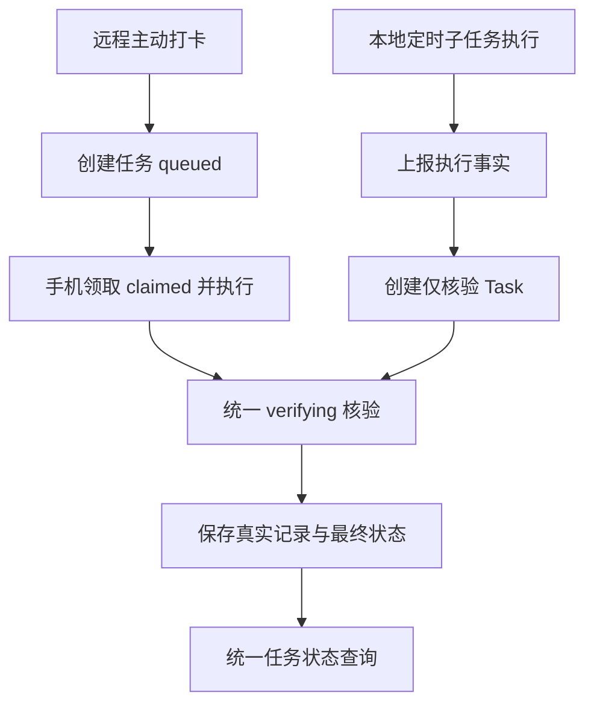

# 本地定时打卡接入统一 Task 核验

日期：2026-09-20。

状态：2026-09-20 已完成开发，并按用户随后明确授权部署到 MCP 服务端和手机。未新建 Trellis 任务；用户已授权将本功能作为独立 Git 提交保存，未授权推送。开发起点为 `0935135`（动态员工查询与完整打卡明细）。

## 一、用户已确认的目标和边界

1. 本次补齐 AutoJs6 本地定时子任务执行之后的真实考勤核验，解决目前“拉起钉钉后，不再确认是否实际打卡”的缺口。
2. 只采用服务端查询钉钉 API，不采用客户端页面识别、无障碍识别、截图或 OCR。
3. 主动远程打卡和被动本地定时打卡复用现有 Task 管理：任务持久化、后台轮询、状态更新、考勤结果保存和查询共用一套机制。
4. 本地定时任务执行后向服务器上报，由上报创建“仅核验”的 Task；不让服务器再次下发亮屏或打开钉钉命令。
5. **本次不处理“子任务根本没有启动”的检测。** 用户明确知道事后上报的覆盖边界；子任务是否启动继续查看 AutoJs6 日志，当前调度已基本稳定、延迟较短。
6. 因此不加入规划阶段预登记、主任务／子任务启动巡检、漏启动看门狗或新的固定时刻唤醒措施。不要在后续开发中再次把这些能力扩大为本次前置条件。
7. 保留现有随机计划、执行窗口、设备动作及其互斥规则。不得因为上报或核验失败，自动重复设备动作、修改随机时间或延长设备动作窗口。

用户已自行关闭此前干扰打卡的系统闹钟。本次不重新配置系统闹钟，也不修改 AutoJs6 已有任务的日期、星期或循环规则。

## 二、当前实现及可复用部分

| 位置 | 当前职责与约束 |
|---|---|
| `autojs6/autojs6_autowake.js` | 规划随机子任务；子任务执行亮屏、拉起钉钉并保存本地计划状态；目前没有服务端考勤核验 |
| `autojs6/office_device_actions.js` | 共用设备文件锁、亮屏、保亮、启动应用；`APP_REQUESTED` 仅表示启动请求，不能作为打卡成功 |
| `autojs6/office_remote_listener.js` | 常驻领取远程命令、持久化动作标记及回执、断线重传；可评估复用其常驻发送能力 |
| `Features/DeviceCommands/DeviceCommandStore.cs` | 文件原子替换、单实例锁、幂等请求、任务领取和状态保存 |
| `Features/Attendance/ClockInService.cs` | 创建主动任务、读取执行前基线、核验真实记录、生成对外结果 |
| `Features/Attendance/ClockInWorker.cs` | 后台遍历未结束考勤任务，调用同一核验流程，重启后继续处理 |
| `Features/DeviceCommands/DeviceCommandEndpoints.cs` | 设备独立认证、领取命令和带领取凭据的动作回执 |
| `Features/Attendance/ClockInEndpoints.cs` | `attendance_clock_in` 和 `attendance_clock_in_status` MCP 对应的 HTTP 接口 |

上述 C# 路径均相对于 `src/OfficeMcp.Api/`。现有核验读取 `/topapi/attendance/getupdatedata`；动态考勤查询工具使用 `/attendance/listRecord`。这次目标是复用 Task 核验，不要求顺带更换原核验上游或重写动态员工查询。

当前本地脚本日志中的“等待服务端核验考勤”来自共用模块文案，并不代表本地任务已接入核验。实现时应让文案准确反映实际上报、核验与结果状态。

## 三、拟采用的接入方式

- 保留当前主动打卡入口，新增使用设备认证的本地执行上报入口；不得让定时脚本调用主动打卡创建接口来生成 Task。
- Task 明确区分远程命令与本地定时来源。具体字段名可随实现确定，但“是否需要下发设备动作”必须是明确且可校验的语义。
- 本地上报创建的任务直接进入 `verifying`，初始化完整的核验上下文和核验期限；不虚构领取步骤、领取令牌或远程执行时间。
- 设备领取接口显式排除本地仅核验任务，不只依赖调用者恰好填对状态。
- 两种来源继续由同一个后台核验入口处理，不复制一份轮询循环或第二套任务存储。
- 现有状态查询应能查询本地来源任务，保留原 operationId 和已有远程调用兼容性。增加来源及实际执行信息时同步修改说明，避免仍把所有结果描述为“远程命令”。

## 四、必须满足的实现约束

### 4.1 执行标识、上报和幂等

- 手机在设备动作前生成并持久化稳定的本地执行标识，例如 UUID `local_run_id`；它不等同于可能复用的 AutoJs6 数字任务 ID。
- 保存执行开始、亮屏确认、启动请求及动作结果；动作失败、中断或过期也应尽可能进入上报记录，不能只上报启动成功的情况。
- 网络失败时把待上报记录保留在本地，恢复后仅重传上报，不重新亮屏或打开钉钉。
- 同一个执行标识重复上报，服务器返回同一个 `task_id`。更换员工、日期、类型等语义的冲突请求应拒绝，不能覆盖已有任务。
- 正在核验的任务不能因重传重置期限；终态不能被迟到回执覆盖。
- 本地定时入口和远程接收器共用动作函数时，必须传递或识别来源，避免一次远程执行又自动生成第二个本地核验任务。
- 上报实现不得使本地动作依赖服务器在线。采用即时短请求还是由常驻脚本发送持久化待办，可根据现有代码选择，但必须保证失败可恢复、不会抢占原回执处理或长时间阻塞定时动作。

### 4.2 真实执行时间与核验期限

- 区分手机的真实执行时间、服务器接收时间、Task 创建时间、核验截止时间。
- 现有 `ConfirmsNewRecord` 使用 `job.CreatedAt.AddSeconds(-30)` 判断记录新旧，不能原样用于延迟补报的本地任务。例如手机先执行、几分钟后才联网建 Task，不能因此排除已产生的有效考勤。
- 本地任务的记录匹配应基于执行时间和目标工作日／打卡类型，并处理手机与服务器时钟偏差；时间字段统一采用明确的时间戳或带时区时间。
- 核验窗口在首次接受上报时确定，补报不能因原执行时间已过去而完全跳过读取；同时必须有有限期限，重复上报不得无限续期。
- 设备动作截止与只读核验截止分开。超过设备动作窗口后仍可继续只读核验，但禁止补发动作。
- 历史补报不能被主动接口“仅允许今日上班”的参数规则误拒绝；允许补报的日期范围及时间校验策略在实施前明确。

### 4.3 事后上报与基线的差异

- 远程任务可以在下发动作之前读取考勤基线；本地完成后上报时，首次读取可能已经包含本次打卡结果。
- **不得把事后首次读取的结果伪装成执行前基线，再要求它变化一次才能成功。** 未采集事前基线与事前确认无记录是不同情况。
- 需要区分“执行前已有对应记录”“查到与本次执行时间相符的记录”“暂未确认／读取失败”。返回真实打卡时间和考勤状态。
- 没有可靠事前基线时，可确认记录存在和时间关系，不得声称严格证明该记录只由本次拉起动作产生。
- 本次不为取得基线而引入规划阶段预登记。若采用执行开始时的可选上报，也不能把其网络成功作为设备动作的前提。
- “是否打卡”与“考勤是否正常”独立：迟到等记录仍可能证明已经打卡。空结果不能直接推断缺卡、休息或任务执行失败。
- 核验超时记为未确认，保留安全错误信息；不得把接口超时等同于实际没有打卡。

### 4.4 并发、认证和旧任务兼容

- 当前 `DeviceCommandStore.CreateAsync` 会因为同设备已有任意未结束 Task 返回 `device_busy`。已发生的本地执行必须能够登记核验，不能因此丢失上报。
- 接受仅核验任务不代表取消设备动作互斥；保留共用设备锁及主动任务原有的动作保护。
- 不同执行实例不能仅因同设备、同日期就随意合并；同一实例的重传由稳定执行标识去重。
- 新接口使用设备认证并核对设备归属；核验员工由服务器绑定，不能通过手机上报任意员工 ID 扩大权限。
- 不削弱原远程回执对 `lease_token` 的校验。仅核验上报使用独立入口，不伪造领取凭据。
- 旧 JSON Task 缺少新增来源字段时应保持原远程任务语义；旧记录必须可读取，后台核验与原 MCP 状态查询继续可用。
- 服务重启后恢复未结束的仅核验任务；整个恢复过程不得产生手机动作。

### 4.5 状态与日志

- 手机记录本地执行标识、上报接受／待重试和对应 `task_id`，便于从 AutoJs6 日志追踪到服务端 Task。
- 服务端 Task 保存来源、执行时间、动作结果、核验过程与真实考勤结果；异常只保存安全错误码和必要说明。
- 根据任务来源调整终态文案。例如本地动作已经执行后，不能仍提示“已有记录，因此本次未执行手机动作”。
- 日志不输出设备密钥、钉钉令牌、无关地址或其他员工信息。文档、测试和提交内容使用合成数据。

## 五、2026-09-20 已确认的实施细节

1. **本地核验目标：** 仅上午随机子任务的 `OnDuty`；不接入下午／下班及手动 `direct`。不更改已有计划编排。
2. **轮询策略：** 沿用现有配置默认 5 秒间隔、首次接受上报后 120 秒期限；超时记为未确认，不追加复查。
3. **补报期限与时钟校验：** 仅首次接收时的北京时间当天可补报。手机实际执行时间用于核验，时间容差 30 秒；已经接受的同一上报跨日重传仍返回原任务，不延长期限。成功记录的时间上限使用实际执行后一个核验周期加容差，避免断网很久后把无关的新卡归于本次执行。
4. **结果呈现：** 保留统一 Task 查询，由现有常驻脚本取回最终结果写入手机日志；待上报及待查询状态持久化，恢复后只补传／查询。
5. **失败通知：** 本次不增加外部消息通知，不接入机器人或新的监控任务。

## 六、验收要点

- 本地执行上报生成仅核验 Task，同一执行重复上报始终返回相同任务。
- 上报、查询、后台核验、超时、服务器重启和断网恢复均不会下发新的设备动作。
- 真实记录晚于执行出现时能被轮询确认；已提前打卡、迟到、未知状态、无记录和 API 故障有明确且不误导的结果。
- 晚到上报不会因 `CreatedAt` 晚于实际打卡而误判；事后读取不被误当作执行前基线。
- 有远程任务未结束时仍能接受本地执行事实；原远程幂等、领取凭据、动作互斥和核验规则不退化。
- 上报失败可持久化并补传；补传不延长既有期限、不覆盖终态、不重复执行动作。
- 旧 Task 文件可读取，新旧两类任务均能通过现有任务查询机制查看。
- 原随机时间、截止策略、已登记计划、手机入口路径及定时任务编排保持不变。
- 按实际改动补充有意义的服务端测试及隔离设备动作的脚本测试；遇默认构建目录占用先串行重试，仍占用则停止，不另换构建目录。

## 七、继续工作时的入口

1. 先阅读本文，保留已确认范围，尤其不要再加入“子任务未启动检测”或规划预登记。
2. 核对当前工作区状态并沿用第五节已经确认的业务细节，不重复扩大范围。
3. 实现位于 Attendance／DeviceCommands 模块、本地定时上报及其重传流程、相关日志和测试；后续调整继续复用现有基础设施。
4. 通用设计与运行说明同步更新到 `autojs6/README.md` 等对应文档；临时排查日志、真实设备与部署资料留在被忽略的本地记录中。
5. 本功能已完成部署并获独立提交授权，不包含后续加班统计开发；未获得 push 授权。真实定时打卡后的完整业务结果仍需由下一次自动任务产生，发布验证没有触发手机打卡。

## 八、实现与验证记录

- `ClockInService.Local.cs` 接受设备执行事实、规范化 UUID、限定当天首次补报、校验阶段顺序和时钟容差；幂等查询先于补报日期检查。
- 共用业务 Kind 和 Worker；Task 来源区分 `remote_command` / `local_schedule`，旧记录默认远程；领取时显式要求远程来源，本地事实可与未完成远程 Task 并存。
- 新增仅设备可用的 POST `/api/devices/{device_id}/attendance/executions`、GET `/api/devices/{device_id}/attendance/tasks/{task_id}`；原 MCP 状态工具可查询两种来源，无需新增工具。
- 新增 `office_attendance_queue.js`，使用 Android AtomicFile 和每次执行独立文件锁保存事实。常驻接收器优先处理原远程回执，每轮最多一个本地短请求，保留失败重传和最终结果；未得到服务端接受时不声称进入核验。
- C# 测试通过 74 项；AutoJs6 隔离脚本测试通过 30 项。包含后置首读、迟到、旧记录、时间边界、未知状态、API 故障、并发幂等、跨日重传、设备认证、原远程流程、磁盘恢复、随机窗口、执行中断、队列恢复、日志回写和接收器停止。
- 发布时发现旧常驻实例停止等待超过原辅助脚本的 45 秒。确认旧实例退出后才启动新实例，并补充每轮显式检查线程中断及本引擎停止标记；停止时已领取命令保留不确定回执，不补执行动作。
- 真机 26 项隔离检查通过，包括四脚本 Rhino 编译、Android AtomicFile、独立执行锁、队列往返、配置与计划不变、设备认证及新接口校验。使用独立测试目录和内存传输，未创建真实核验 Task、未亮屏或拉起钉钉。
- MCP 服务及网关已部署就绪，公网四个工具、旧 Task 新摘要及当天考勤只读查询通过；既有任务与凭据保留。手机四脚本哈希与工作区一致，接收器单实例在线，已登记主任务和历史计划保持不变。运维路径、备份和验收证据记录在被忽略的本地发布文档中。
